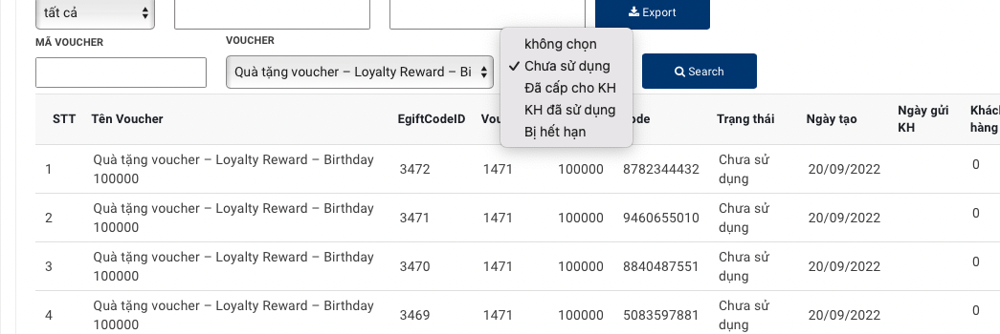
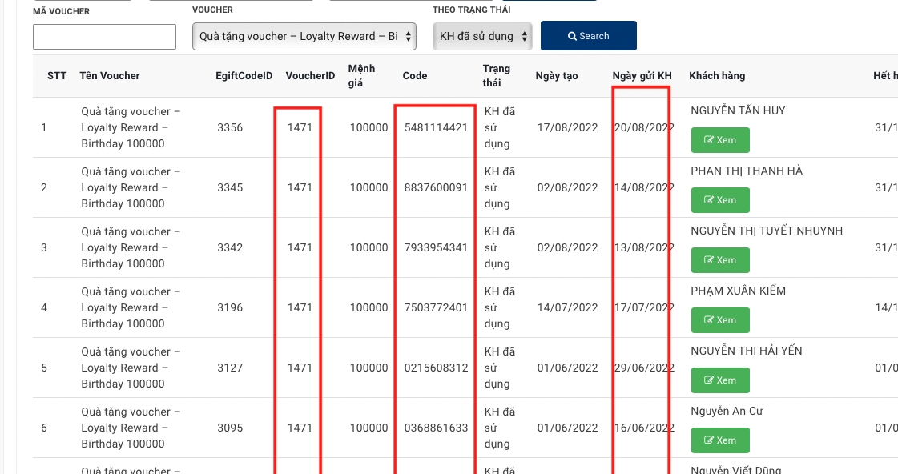
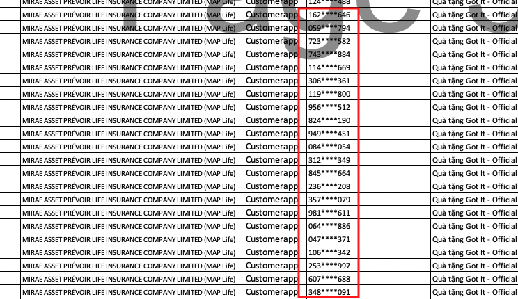

:docinfo: shared
:stylesheet: my-stylesheet.css
:last-update-label!:

== Cách đối soát Voucher Gotit dựa trên AdminCP

Các trạng thái của Voucher trên AdminCP

. *Chưa sử dụng* : là những voucher Gotit hợp lệ (còn hạn sử dụng), và chưa gửi cho Khách hàng Maplife

. *Đã cấp cho KH* : là những Voucher hợp lệ (còn hạn sử dụng), đã gửi cho Khách hàng, nhưng họ chưa sử dụng 

. *KH đã sử dụng* : là những Voucher đã được sử dụng, phát sinh giao dịch, được xác nhận bởi Gotit

* Ghi chú 

** Code là mã do Gotit cung cấp, để đổi soát, tìm kiếm

** trên AdminCP không có ngày sử dụng voucher, do Voucher được sử dụng bên hệ thống của Gotit 

. *Bị hết hạn*: là những voucher chưa được sử dụng, thì đã hết hạn. 

== Kết luận

* Voucher được *Khách hàng đã sử dụng* mới phát sinh chi phí bên Gotit, còn các các Voucher khác không có

* Việc import bị lỗi, không sinh ra trong *Kho Voucher* của AdminCP, không gửi tới Khách hàng, không ảnh hưởng tới việc đối soát. 

* Bên Gotit cần cung cấp đầy đủ Code để so sánh đối chiếu ngẫu nhiên dễ dàng, file excel chỉ có 3 chữ đầu và cuối

* Danh sách voucher Gotit cung cấp trong file đối soát, có thể là Danh sách import vào AdminCP của Maplife, chứ chưa phải là Voucher được sử dụng thực tế. 

