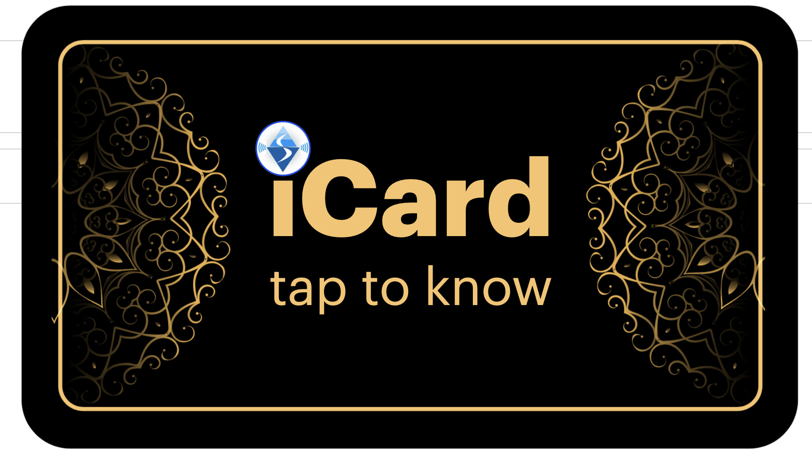
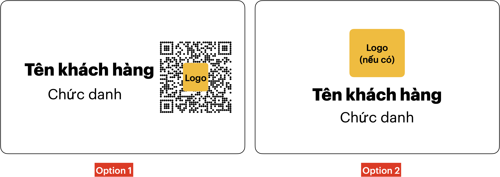

:docinfo: shared
:last-update-label!:

== iCard Quy trình Giới thiệu iCard trực tiếp tới khách hàng 

=== Khách hàng tiềm năng

* Cá nhân có iPhone đời mới, hoặc android có NFC
* Công việc kinh doanh, hay giao tiếp với khách hàng
* Thích trải nghiệm công nghệ mới.

=== Địa điểm Giới thiệu iCard

* Cửa hàng kinh doanh, có nhiều khách hàng:

** quán cafe, quán ăn nhà hàng, 
** Phòng gym, spa, thẩm mỹ viện, nha khoa,...
** Cửa hàng kinh doanh: bán điện thoại, vật liệu xây dựng,...

* Địa điểm có nhiều người sử dụng iPhone tụ tập
** Phòng chờ xem phim
** Phòng gym, spa, ...

* Đối tượng tiếp cận: nhân viên và cả khách hàng tại quán đang sử dụng iPhone

=== Bước 1: Giới thiệu iCard tới khách hàng tiềm năng

* Quan sát đối tượng phù hợp: 

** Đang sử dụng iPhone một mình hay với bạn bè
** Có thời gian để giới thiệu sơ lược: 

* Dùng iCard của bản thân (được cung cấp) để giới thiệu tính năng *Tap to View*

** Tap bằng iPhone
** Xem thông tin iCard: zalo, facebook,...
** Click to call , add to contact, 

* Giới thiệu sản phẩm iCard 

[.float-group]
--
[.left]
.Sample 

--

** iCard chuẩn: 1 Thẻ chip nhựa in theo mẫu, 2 tem qrcode tròn, 1 Thẻ thiết lập 

** Giá 149,000 đ / 1 Bộ, Mua 5 bộ tặng 1 bộ

=== Bước 3: Hỗ trợ khi bán hàng

* Hướng dẫn sử dụng iCard cơ bản : dựa trên Tờ hướng dẫn 

** Cập nhật Avatar, tên, số điện thoại
** Cách chạm NFC trên iPhone và điện thoại Android của khách hàng 

* Hỗ trợ tuỳ biến khi khách hàng mua iCard chuẩn  

** Miễn phí in Tên, Chức vụ lên mặt trống (giao hàng sau 5 ngày)

** Phụ phí 30k nếu in theo Mẫu iCard có sẵn

** Thu hồi Thẻ đang có khi giao Thẻ tuỳ biến 

=== Quy trình Tuỳ biến iCard

Lấy thông tin tuỳ biến:

* Cơ bản: 
** In lên Thẻ: Tên khách hàng, Chức danh, In qrcode hay không (tuỳ chọn), 

** Mẫu Thẻ dựa vào danh sách template chuẩn 

** gửi vào Group Zalo hỗ trợ Kèm với ID của iCard 

* Nâng cao: 

** Add vào group Zalo để Khách hàng cung cấp file Thiết kế .ai, .pdf

Giao hàng sau 3-5 ngày làm việc:

* Bạn Sale sẽ giao Thẻ thiết kế cho khách hàng, và thu hồi lại Thẻ mặc định

* Lấy ý kiến Khách hàng: phản hồi sử dụng, và nhu cầu mua mới trong tương lai 

=== Bước 4: Cập nhật thực tế

* Dùng thẻ thiết lập của Sales, dán mặt sau của iCard Danh thiếp, thực hiện việc update hình ảnh thực tế
   
** [video-huongdan](https://t.me/ishop_vinaas/9)

* Ghi chú phản hồi của khách hàng:
** trạng thái: quan tâm, không quan tâm, nghi ngại, sản phẩm đắt,...
** khuyến nghị tiếp theo: có nên quay lại hay ko?

* Ghi chú với khách mua hàng:
** tên, số điện thoại để hỗ trợ sau này
