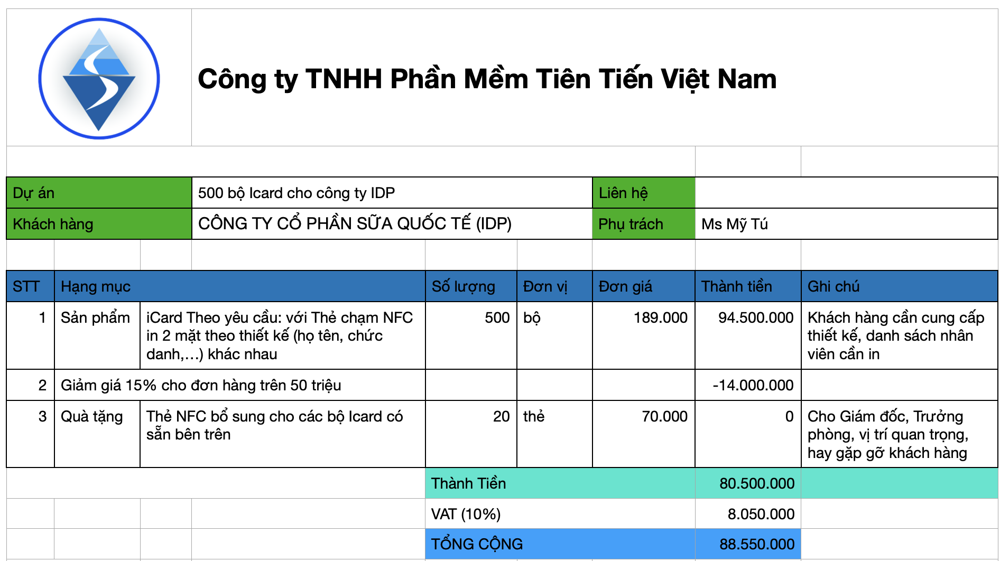
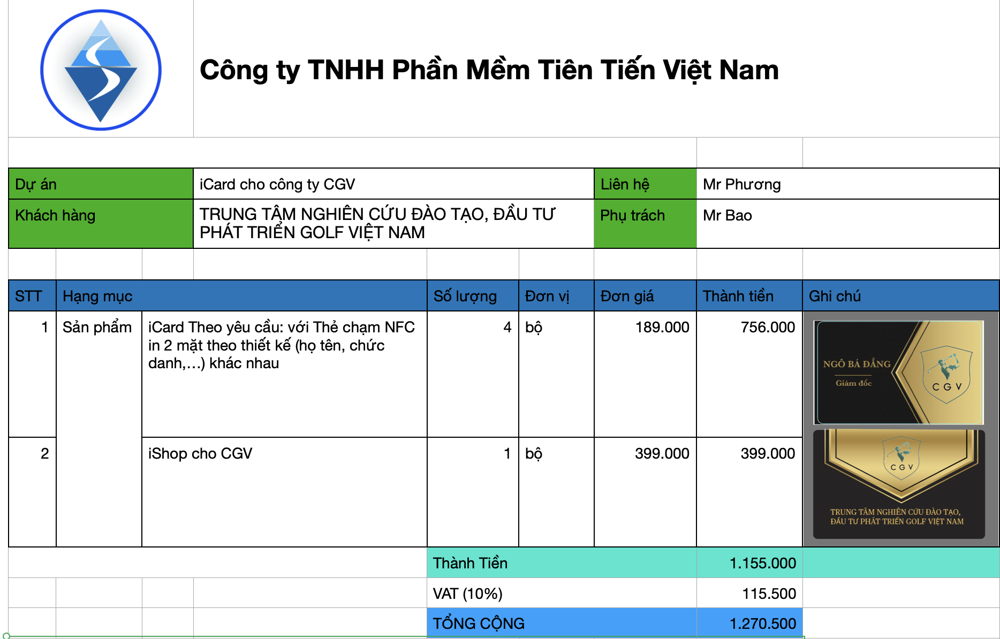
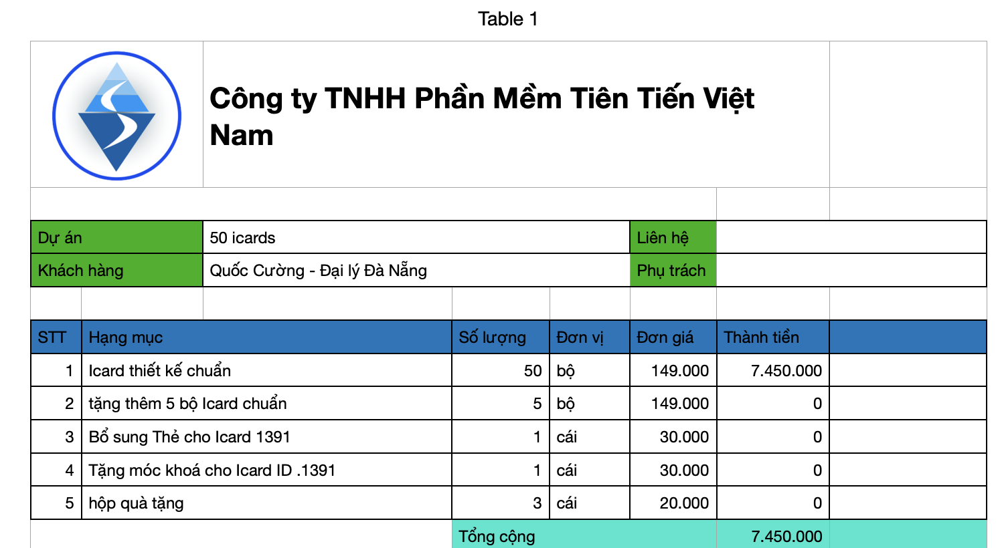

== Sản phẩm, dịch vụ mà VinaAS cung cấp

=== Mèo may mắn + iCard

Biểu tượng mèo may mắn:: 
* phù hợp với năm Quý Mão (2023): mèo, và là biểu tượng mèo lôi kéo khách, may mắn của nhật bản 

* Slogan `tặng nhau may mắn đầu năm` ý nghĩa hơn là phong bì lì xì

** dán vào điện thoại, mang theo may mắn suốt năm 

Chạm mèo bằng điện thoại:: 

* Slogan `Chạm mèo để nhận may mắn` 
* biết rõ hơn về nhau, giới thiệu nhau cơ hội đầu năm 

Món quà ý nghĩa:: 

* Tặng nhân viên đầu năm: Mèo may mắn iCard (99k) hoặc iCard 179k 

* Nhà phân phối, đại lý đầu năm: Mèo may mắn iCard (99k)

* Tặng khách hàng VIP những người mua hàng giá trị 

** Biểu tượng Mèo: (5k)

** Mèo iCard nếu khách mua hàng giá trị hoặc chịu trả tiền

=== Lọ nhũ vàng

Hoàng kim:: 

* màu vương giả, vua chúa và cả màu chùa 
* nổi bật vật dụng cá nhân

Mục đích:: 

* Khách hàng khám phá Lọ nhũ vàng cho nhu cầu cá nhân:
* Khách hàng mua lọ, chai nhũ cho nhu cầu

Trang trí vật cá nhân 

=== iShowroom 

Tăng nhận diện của cộng đồng về sản phẩm 

Thúc đẩy 3 hành vi chính của người dùng 

* `Chạm biểu tượng` để biết thông tin
* `Chụp hình ảnh thực tế` để góp ý, cập nhật
* `Chia sẻ hình ảnh` để giới thiệu , ủng hộ 

Minh hoạ mô hình tương tác với khách hàng 

* Tương tác với iCard: vật dụng cá nhân: mèo may mắn, ốp lưng điện thoại, móc khoá, thẻ 

* Tương tác với iShowroom, mô hình showroom in Shop: sample, sản phẩm, tài liệu

** Sản phẩm tiêu biểu: gây chú ý, trải nghiệm tại chỗ, mua bán tại chỗ

** Đặt mua từ xa, tới cửa hàng để trải nghiệm 

* Tương tác với iShop: bản hình, poster khuyến mãi 

** Chương trình tương tác để nhận khuyến mãi

** Tương tác sau khi nhận quà 

== Chân dung khách hàng mà VinaAS phục vụ

=== Doanh nghiệp, tổ chức sử dụng các sản phẩm iCard, iShop với các tính năng đang có 

Doanh nghiệp cần iCard::

* là công cụ trang bị cho nhân viên hoặc quà tặng cho khách hàng.

* Bảng giá tổng quan => dự toán cho khách hàng 

** iCard làm quà tặng: số lượng tối thiểu 50 bộ

** iCard cho nhân viên: từ 179k / bộ. Số lượng tối thiểu 10 bộ 

* Khi có nhu cầu cụ thể, lên báo giá chi tiết,  

** công ty sữa cần 500 iCard cho nhân viên 

** 4 bộ icard mẫu 

Đại lý kinh doanh iCard::
* iCard tiêu chuẩn từ 149k / bộ 

Doanh nghiệp cần iSHOP:: 

* Công cụ cho cửa hàng, địa điểm kinh doanh: 
* Công cụ cho đội ngũ bán hàng 
* Bảng giá tổng quan: 

** 1 tới 3 triệu đồng / năm cho 1 địa điểm kinh doanh,  gia hạn theo năm 
** tối đa 10 iCard cho 1 iShop 

iShowroom 

* iCompany: từ 20 triệu đồng / năm
** Cho Doanh nghiệp với quy mô không quá 20 cửa hàng.
** Cho Mạng lưới bán hàng không quá 20 Đại lý và 100 Cộng tác viên 

* iDistributors: từ 50 triệu đồng / năm
** Cho Doanh nghiệp với quy mô trên 50 cửa hàng, chi nhánh
** Cho Kênh phân phối không quá 50 Nhà phân phối và 300 Cộng tác viên 

* iEnterprise: từ 200 triệu đồng / năm
** Cho tập đoàn, doanh nghiệp lớn lớn trên 200 chi nhánh, cửa hàng

Phí tuỳ biến::

* cho đơn hàng từ 50 triệu đồng 
* bảng giá lựa chọn tuỳ biến 
* Phí lập trình tuỳ chỉnh: 20USD / giờ 

http://snv.daknong.gov.vn
http://dakglong.daknong.gov.vn
http://stc.daknong.gov.vn
http://stnmt.daknong.gov.vn
http://hdnd.daknong.gov.vn
http://truongchinhtri.daknong.gov.vn
http://qbvr.daknong.gov.vn
http://cujut.daknong.gov.vn
http://sldtbxh.daknong.gov.vn
http://svhttdl.daknong.gov.vn
http://sgtvt.daknong.gov.vn
http://thanhtra.daknong.gov.vn
http://ldld.daknong.gov.vn
http://ubmttq.daknong.gov.vn
http://stp.daknong.gov.vn
http://dakrlap.daknong.gov.vn
http://krongno.daknong.gov.vn
http://gianghia.daknong.gov.vn
http://xsct.daknong.gov.vn

