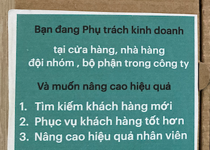
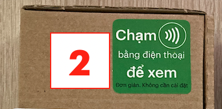
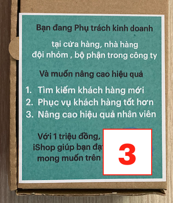

## iShop: B2C trực tiếp 

### Khách hàng tiềm năng

- Cửa hàng kinh doanh đơn lẻ: 
  - quán cafe, quán ăn nhà hàng, 
  - phòng gym, spa, thẩm mỹ viện, nha khoa,...
  - tạp hoá lớn,...

- Không tiếp cập cửa hàng chuỗi: cafe highland, cửa hàng tiện lợi, fastfood, 

- Đối tượng tiếp cận: chủ quán hoặc quản lý 
- Cửa hàng quy mô vừa phải, có khả năng trả 1 triệu đồng 

### Quy trình:

#### Bước 1: Lựa chọn tuyến bán hàng 

- Tuyến bán hàng: 
  - là những tuyến đường, khu vực có đông cửa hàng, có thể đi bộ để kiệm thời gian di chuyển
  - mỗi tuyến có tầm 30 cửa hàng phù hợp để giới thiệu
  
- Lựa chọn các cửa hàng sẽ ghé thăm: đi xe máy dọc theo tuyến, hoặc khu vực để lựa chọn cửa hàng phù hợp nhất sẽ ghé trong ngày (5-15 cửa hàng)

- Các cửa hàng ít phù hợp hơn sẽ dành cho đợt 2, đợt 3

- Mỗi tuyến, khu vực sẽ có tầm 3 lần ghé thăm:
  - lần 1: thăm các cửa hàng tiềm năng nhất
  - lần 2: các cửa hàng tiềm năng thứ 2, đồng thời hỏi thăm các cửa hàng đã mua sản phẩm ở lần 1
  - lần 3: thăm lại cửa hàng quan tâm, dùng thử ở 2 đợt trên. 

#### Bước 2: Giới thiệu tới từng cửa hàng 

Chuẩn bị: mỗi bạn sales cần có 

- số 1: 1 Danh thiếp iCards của Sales (số 1)
  - có đầy đủ thông tin
  - dán tem và chip có thể chạm NFC 

- số 2: 1 hộp ishop mẫu để giới thiệu với khách hàng  
  - là hộp có tem "Chạm để xem"

- số 3: là hộp ishop mới, sẽ bán cho khách hàng nếu cần.

1. Giới thiệu ban đầu về ishop:

- chào hỏi chủ cửa hàng, quản lý, nhân viên,...
- giới thiệu là nhân viên công ty, đưa danh thiếp ra, để khách hàng xem

2. Demo iCards bằng Danh thiếp của Sales 

- Dùng điện thoại của Sale, trình diễn việc Chạm NFC trên danh thiếp cho khách hàng xem

- để KH tự thực hiện bằng điện thoại của họ: 
  - để họ quét qrcode trước
  - nếu điện thoại của kh là iphone, hoặc có NFC, thì hướng dẫn cách chạm NFC 

- Nếu khách hàng quan tâm thì qua step 3: 

3. Giới thiệu ishop bằng hộp demo:

- giới thiệu về ishop, theo nội dung trên hộp 

- Nhấn mạnh 3 giá trị mang lại , demo cho từng giá trị này

4. Demo việc "tìm kiếm khách hàng mới" bằng ishop

- tìm kiếm khách hàng qua zalo:
    - minh hoạ bằng chụp hình hộp demo, có qrcode màu xanh phía trên
    - sau khi truy cập, vô đặt hàng,  liên hệ,...

- tìm kiếm khách hàng qua facebook,...

- In, Dán tem qrcode lên tờ rơi, sản phẩm, để tìm kiếm khách hàng 

1. Demo giá trị "Phục vụ khách hàng tốt hơn" 

- Chạm NFC lên tem "Chạm để xem" 

- mở hộp demo, đưa cho khách hàng xem tem qrcode, tem và chip chạm để xem
- hướng dẫn cách sử dụng chips dán: 
    - tại cửa ra vào, tại bàn, tại chỗ thu ngân,...

- demo tính năng: thanh toán online qua momo, ngân hàng,...

1. Demo Giá trị "Nâng cao hiệu quả nhân viên" 

- Dùng thẻ thiết lập của Sales, dán mặt sau của iCard Danh thiếp, thực hiện việc update hình ảnh thực tế

    - [video-huongdan](https://t.me/ishop_vinaas/9)

- Giới thiệu với khách hàng quy trình cập nhật hình ảnh của iCards, và quản lý có ishop sẽ nhận được.

- Show trong hộp demo, các icards, và thẻ thiết lập đồng thời ishop để khách hàng hình dung

#### Bước 3: Bàn giao iShop, hướng dẫn và thu tiền

> khi khách hàng đồng ý mua sản phẩm

- Đưa hộp ishop mới cho khác, số 3

1. nhập thông tin ban đầu cho ishop
- để khách hàng tự làm, nhân viên hướng dẫn hỗ trợ 

2. nhập thông tin ban đầu cho icards 

- khách hàng chọn 1 icards và tự làm

3. Cách dùng thẻ thiết lập của iShop

- thêm nhân viên iCards vào

- cách lấy mã qrcode để tự in ấn 

- cách lấy link để chia sẻ, tìm kiếm khách hàng

4. Hướng dẫn khách hàng quét qrcode trên hộp để tìm hiểu thêm thông tin, liên hệ khi cần

#### Bước 4: Cập nhật thực tế

- Dùng thẻ thiết lập của Sales, dán mặt sau của iCard Danh thiếp, thực hiện việc update hình ảnh thực tế

    - [video-huongdan](https://t.me/ishop_vinaas/9)

- Ghi chú phản hồi của khách hàng:
    - trạng thái: quan tâm, không quan tâm, nghi ngại, sản phẩm đắt,...
    - khuyến nghị tiếp theo: có nên quay lại hay ko?

- Ghi chú với khách mua hàng:
    - tên, số điện thoại để hỗ trợ sau này

#### Tham khảo thêm 

- [Tổng quan ishop](https://vinaas.com/ishop.iapp)
- [Trang chủ](/)