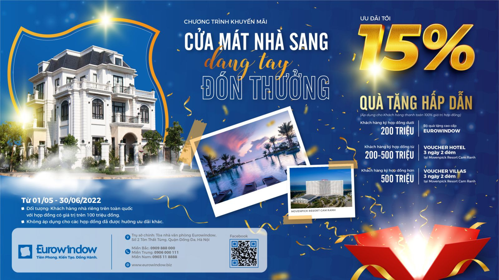

### 

iStand:

- keyword: "qrcode cho tiệc cưới", "qrcode cho hội nghị", "qrcode hội thảo", "marketing bằng qrcode" 

iShop:  
- mã qr cho cửa hàng , qrcode cho cửa hàng,
- chạm để xem menu , chạm để xem khuyến mãi

Kính gửi công ty Eurowindows

Được biết Quý công ty đang là nhà tài trợ chính (có gian hàng) tại triễn lãm việt build lần 2 ở HCM.

Bên cạnh khách hàng mới là những người tham quan Việt Build, có không
ít người từng sử dụng sản phẩm, là đối tác, đại lý,... của Eurowindows, được biết và ghé thăm gian hàng, mua hàng,...

http://www.lifewindow.ritavo.com/tin-tuc/tin-cong-ty/life-window-chuong-trinh-khuyen-mai-giam-18-cho-khach-hang-tai-trien-lam-vietbuild-226-266

https://eurowindow.biz/tin-tuc/tin-tuc-su-kien/the-le-chuong-trinh-khuyen-mai-“cua-mat-nha-sang-–-dang-tay-don-thuong”.html

Và xin giới thiệu iTicket, vé mời cá nhân, một giải pháp công nghệ giúp tăng số người biết tới và ghé thăm gian hàng của Việt build. 

Đầu tiên iTicket sẽ tăng tỉ lệ những người được mời, dành thời gian tới Vietbuild và ghé thăm gian hàng.

- iTicket thiết kế trang trọng,và được cá nhân hoá, có tên người được mời, giúp gây chú ý và thiện cảm khi gửi thư. 
Lúc gửi thư, nhân viên có cơ hội trò chuyện, chia sẻ thêm về quà tặng, giá trị để lôi kéo khách hàng.

- iTicket sẽ chứa đầy đủ thông tin thời gian, địa điểm kèm công cụ nhắc nhớ và chỉ đường để người nhận thư không quên. 

Quý công ty có thể gửi iTickets qua mạng lưới Đại lý, đối tác, cộng tác viên.... những người sẽ chuyển thư mời tới người có nhu cầu, qua các công cụ liên hệ Online, trực tiếp giữa các cá nhân như zalo, facebook,...

Những người có iTicket, khi ghé gian hàng hay mua hàng,... sẽ xác định được người gửi thư, 
Quan trọng hơn, iTicket ghi nhận những người nhận thư có ghé vào gian hàng của Quý công ty, là cơ sở để trả chi phí giới thiệu cho những đối tượng tích cực, không chỉ mời khách ghé gian hàng, mà còn mua hàng của Eurowindows. 

Với chế độ thưởng hợp lý cho việc "invite to earn" này,  Quý công ty sẽ có nhiều khách hàng mới, được giới thiệu bởi nhiều đối tượng mở rộng, sẽ quay lại mua hàng trong nhiều triễn lãm hay thời gian tiếp theo. 

Đây là cơ chế quan trọng của iTickets, nâng cao hiệu quả bán hàng, quảng bá của Quý công ty

Nếu Quý công ty quan tâm về iTicket, hãy liên hệ với chúng tôi qua email này, cho biết một số yêu cầu cơ bản
- số lượng khách sẽ được nhận iTicket
- khuyến mãi cho khách có iTickets : quà tặng khi ghé gian hàng, giảm giá khi mua,...

Chỉ với 2 triệu đồng, quý công ty có thể bắt đầu với 500 iTickets, kèm với 3k đồng/ 1 ticket tiếp theo.

Hãy cho biết số lượng khách hàng cần mời, Chúng tôi sẽ gửi file có đủ số iTicket và chỉ sau 1 ngày được hướng dẫn, nhân viên hay đối tác của Quý công ty sẽ có thể gửi iTicket tới từng khách mời. 

Nếu 

Xin giới thiệu một giải pháp công nghệ để tăng số lượng khách ghé lại gian hàng của Quý công ty. 

Những khách ghé gian này đa phần là khách tham quan, do Ban tổ chức quảng báo, lôi kéo tới triễn lãm.
Nhưng cũng có nhiều người là khách hàng cũ, là đối tác, là bạn bè, người thân,... nhận được giới thiệu,
hay trịnh trọng hơn là thư mời từ Quý công ty, 

Giải pháp của chúng tôi, tên là iTicket, sẽ gia tăng hiệu quả của việc "kéo khách hàng ghé gian hàng" thông qua thư mời. 

Thông tin về gian hàng của Quý công ty sẽ được đóng góp vào trong mã qrcode, và mỗi thư mời sẽ có 1 id riêng,với tên của khách được mời. Mã qrcode cho phép dán lên Thư mời giấy, hoặc gắn vào hình thư mời, ... giúp việc gửi thư tới từng
khách hàng dễ dàng hơn. Xem hình.

Thư mời cá nhân, riêng từng người, thiết kế trang trọng, gây ấn tượng hơn là 1 thư mời chung chung.

Phôi thư mời sẽ được chuẩn bị trước, thông tin khách mời có thể được điền dễ dàng, nhanh chóng bởi nhân viên của Quý công ty. 

