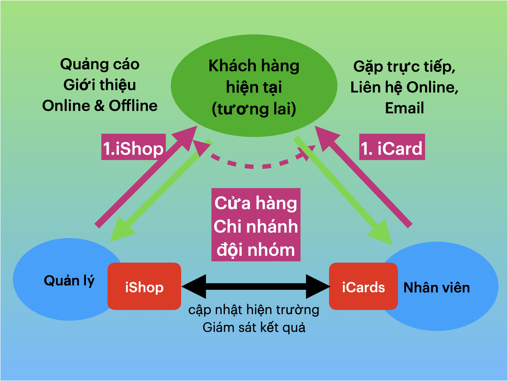
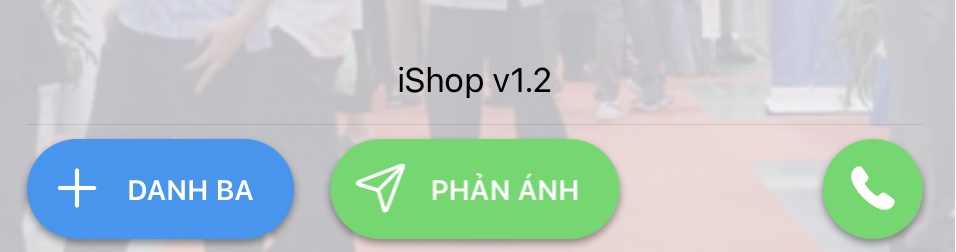

## iShop là gì?

### Định nghĩa 
iShop là sản phẩm công nghệ dành cho một địa điểm:cửa hàng kinh doanh, phòng giao dịch, chi nhánh… của Doanh nghiệp.

### Tổng quan về iShop và iCard 

iShop giúp từng địa điểm sẽ nâng cao hiệu quả cho các hoạt động sau: 

1. Tìm kiếm khách hàng mới trong khu vực 
1. phục vụ khách hàng tốt hơn theo khu vực 
1. nâng cao hiệu quả của nhân viên

Hầu hết lĩnh vực, ngành nghề kinh doanh, có thể sử dụng iShop 
- Bất động sản: Sàn giao dịch, nhà mẫu, 
- Chăm sóc sức khoẻ: thẩm mĩ viện, spa, phòng gym, bán dụng cụ ...
- Bảo hiểm: đội nhóm tư vấn bảo hiểm
- Dịch vụ: du lịch, tư vấn du học, tuyển sinh,...
- Xe máy & oto: kinh doanh, sửa chữa, phụ tùng,...
- Xây dựng & gia dụng: Cửa hàng vật liệu xây dựng, nội thất, thiết kế,...
- Dịch vụ đường phố: nhà hàng, quán xá,…

Công dụng khác của iShop

- Áp dụng cho một Đội nhóm, Phòng ban để phục vụ một đối tượng khách hàng cụ thể của Doanh nghiệp, ví dụ iShop cho Đội bán hàng B2B, phòng tư vấn tín dụng cá nhân (hoặc doanh nghiệp),…

- Sử dụng như 1 Trang Tuyển dụng địa phương, Tìm kiếm Nhà Phân phối cho một khu vực, …

> Cơ chế triển khai 

Nhân viên đứng đầu mỗi địa điểm sẽ vận hành 1 bộ iShop, 
- chủ động thay đổi thông tin
- theo dõi tương tác, phản hồi của khách hàng và hỗ trợ ngay khi cần
- giám sát hoạt động của Nhân viên bên dưới bằng quy trình cập nhật hiện trường thông qua iCard.

Doanh nghiệp có nhiều cửa hàng, chi nhánh,... sẽ có nhiều bộ iShop, kết nối với nhau để phục vụ đúng theo khu vực, nhu cầu của khách hàng.

> Kết nối, Mở rộng các giải pháp khác 

Ngoài iShop cho Cửa hàng, iCards cho Nhân Viên, Doanh nghiệp có thể bổ sung các công cụ để bán hàng(iTicket, iVoucher) và chăm sóc từng khách hàng tốt hơn(iDocument, iProduct) 

### Tìm kiếm khách hàng mới

Để có khách hàng mới, chúng ta phải tốn chi phí cho các nguồn quảng cáo, giới thiệu. Thông điệp được truyền tải tới người xem, ngoài việc gây chú ý (*),còn thúc đẩy  dẫn dắt họ trở thành khách hàng, theo mô hình bên dưới

iShop tích hợp vào mô hình trên, tập trung ở A2,A3,A4, để cải thiện hiệu quả việc tìm kiếm khách hàng mới, đồng thời đánh giá, so sánh được kết quả giữa các kênh, phương pháp quảng cáo, giới thiệu 

#### iShop ở A2: Thúc đẩy người xem hành động hành động 

iShop cho phép **người xem có nhu cầu, hành động ngay trên điện thoại**: chạm NFC, quét qrcode, bấm vào URL, trên thông điệp họ vừa thấy

Quảng cáo có thể là tin bài Online trên Facebook, link bên dưới video trên youtube, tiktok,... 

Và với zalo mobile, (một công cụ rất phổ biến ở việc nam), ishop có thể tích hợp lên 1 poster, 1 tấm hình với đầy đủ thông điệp 

iShop cho phép truyền thông trên các kênh Offline như báo giấy, tờ rơi, standee, băng rôn,... tại nơi công cộng bằng cách dán mã qrcode, và cả chip chạm NFC 

#### Tạo hiệu ứng lôi kéo 

Tại sự kiện đông người, nhiều nhãn hàng tham gia, iShop giúp tạo hoạt động gây chú ý, lôi kéo đám đông chia sẻ, tương tác: 
- chạm NFC, thực hiện hành động ... để nhận quà. 
- KOL tham gia hoạt động, chia sẻ trên mạng xã hội để người xem tới nơi tham gia. 

#### Dẫn dắt tới trang mua hàng

Sau tương tác (chạm, quét, bấm), người xem sẽ được dẫn tới mobile web iShop, để họ biết thêm thông tin, và quan trọng hơn là thực hiện hành động: liên hệ, đặt hàng, tìm đường tới nơi,... Mục tiêu chính của trang iShop là thúc đẩy hành động 

iShop sẽ cải thiện hiệu quả bằng cách tăng số lượng người tương tác với nội dung quảng cáo.

#### Đo lường, đánh giá hiệu quả kênh quảng bá, giới thiệu 

cũng như xác định đánh giá, so sánh được hiệu quả của từng nguồn quản 

Việc tìm kiếm dựa trên nhiều nguồn:
-  quảng bá đại chúng trên các kênh Online, quảng bá theo khu vực bằng các hoạt động Offline,
- giới thiệu từ những khách hàng đang có, trong khu vực hoặc từ nơi khác.

Tích hợp iShop, dưới dạng 1 mã qrcode, vào nội dung cần quảng bá, giới thiệu sẽ tăng số lượng tương tác mới,
và đánh giá được kênh truyền thông nào mang lại nhiều khách hàng 

### Phục vụ khách hàng theo khu vực 

iShop cung cấp nhiều tiện ích cho khách hàng

1. Liên hệ trực tiếp tới cửa hàng

    - gọi điện (đặt hàng )
    - để lại số điện thoại để được gọi lại
    - hướng dẫn đường đi tới quán 

1. Phản ánh góp ý ngay tại cửa hàng 
    - không hài lòng về phục vụ tại quán 
    - góp ý để cải thiện 

1. Cập nhật tin mới tại quán, có nhiều loại thông tin 
    - giờ làm việc, lịch nghỉ lễ
    - menu món hàng ngày
    - chương trình khuyến mãi, giảm giá của mỗi cửa hàng
    - tình trạng đông / vắng khách của quán cafe: hướng tới khách hàng thích làm việc tại quán cafe. 

Khách hàng có thể lưu iShop vào danh bạ, bookmark trên điện thoại thông minh 

iShop còn mở ra những mô hình “tìm kiếm khách hàng mới” bền vững:

### Nâng cao hiệu quả đội ngũ nhân viên 

#### Cho nhân viên 
Tiện ích cho cá nhân 

Danh thiếp thông minh: giới thiệu bản thân, công việc với khách hàng

Đánh giá kết quả tương tác của khách hàng

Ghi chú cá nhân

Cập nhật công việc cho Quản lý trực tiếp
- thói quen cập nhật bằng các thao tác đơn giản
- dễ dàng hướng dẫn, đào tạo
- dễ thêm vào quy trình, yêu cầu quản lý hiện tại 

#### Cho quản lý cửa hàng

Công cụ để marketing, tìm kiếm khách hàng trong khu vực 

- tặng bong bóng
- phát tờ rơi

Công cụ tiếp nhận phản hồi, hỗ trợ khách hàng

Giám sát kết quả (thay vì quản lý cách thực hiện)
- bổ sung, thay thế cách báo cáo kết quả hiện tại
- số người chạm, quét,...

quảng bá chung về sản phẩm, dịch vụ của Doanh nghiệp, dẫn dắt khách hàng tới cửa hàng gần nơi sinh
Quảng bá trong khu vực 

### Bảng giá 

Bảng giá bán lẻ iShop

Combo_1 : 

1 triệu đồng / năm đầu tiên, 600k / năm tiếp theo
gồm 1 iShop 399k và 5 iCards : 149k 
cho một địa điểm có tối đa 5 nhân viên

Combo_2: 

3 triệu đồng/ năm đầu tiên, 2,5 triệu đồng/ năm tiếp theo
gồm 1 iShop và 20 iCards
cho một địa điểm có tối đa 20 nhân viên
Bộ iShop cơ bản: 399,000 đ/ bộ , gồm
  - 1 Thẻ thiết lập , 2 chip NFC và  1 qrcode

Mở rộng cho iShop đang có
- Gói 1: 300,000 đ/ 10 chip NFC
- Gói 2: 500,000 đ/ 20 chip NFC

iShop sẽ được phân phối, tư vấn và hỗ trợ theo khu vực khách hàng hoạt động, dựa trên mạng lưới Nhà phân phối trên toàn quốc.

Để liên hệ và đặt mua, vui lòng truy cập vào iShop bên dưới

### Liên hệ & Đặt mua 

https://www.qrcare.vn/s/100010010880009/i/2/p/370