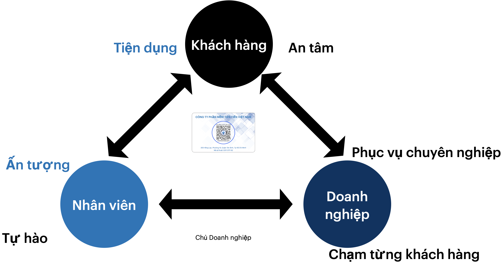
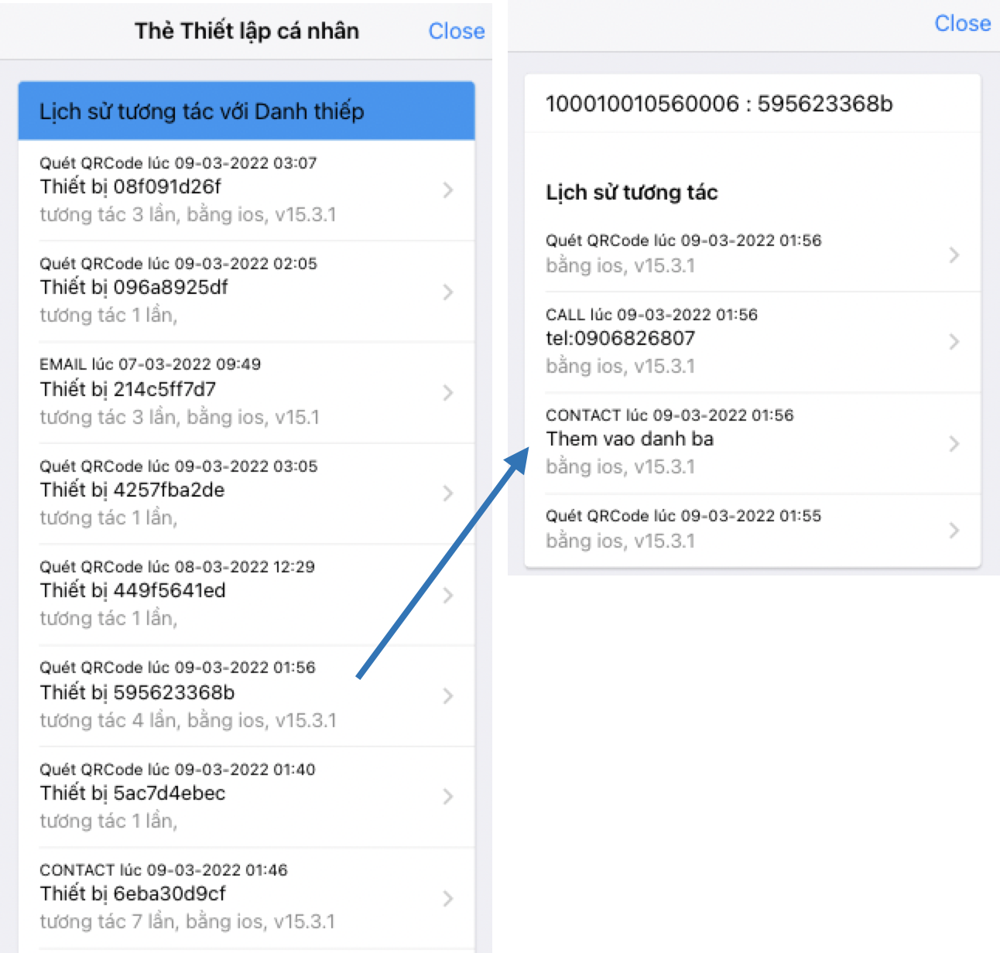
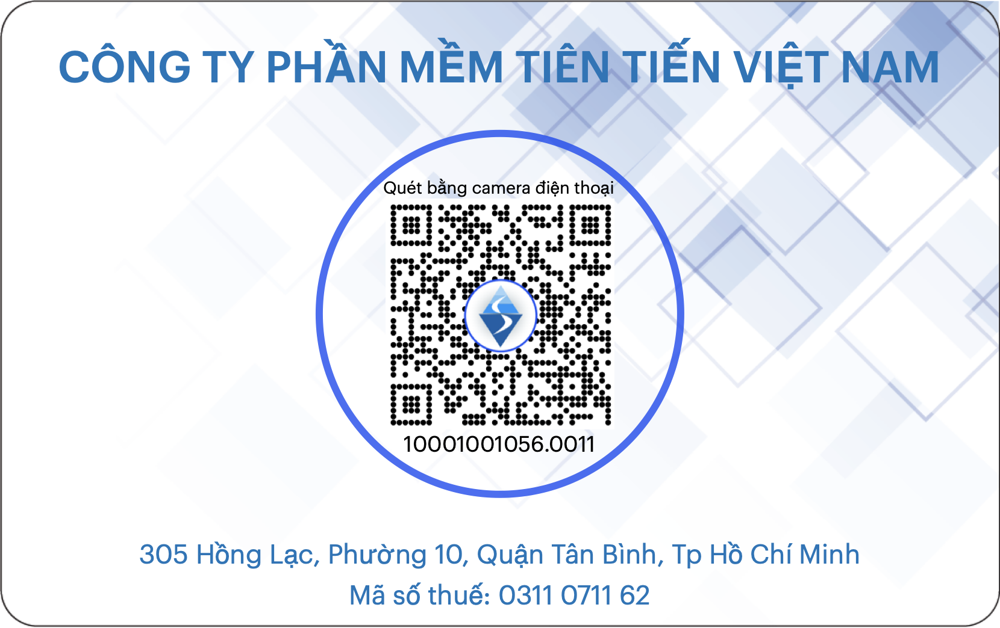

    
## Danh thiếp Tương tác 4.0
> Công nghệ Tương tác

### Naming - keyword

Interaction (touch NFC, scan qrCode, click link, ....) 

Công nghệ tương tác gồm chạm NFC, quét qrcode cho tương tác trực tiếp Offline trên điện thoại, hay click (image, link) trên môi trường Online 

Card: là Danh thiếp chứa thông tin liên lạc của cá nhân (và cả tổ chức)
- Interactive Card (i-card) : Danh Thiếp Tương tác 

Document: tài liệu chứa thông tin giới thiệu về sản phẩm, dịch vụ của Doanh nghiệp

- Interactive Document (i-doc) : Tài liệu tương tác 
- Sampling được xếp vào Document 

Device : sản phẩm (thiết bị) vật lý 
- i-Device : Thiết bị tương tác 

### i-card.qrcare.vn 

Menu 

Header 
- Gây ấn tượng từ lần chạm đầu tiên
- image: hình Danh thiếp + điện thoại
- video: 1 phút về danh thiếp + móc khoá tương tác

Lợi ích 1: tạo chú ý, gây ấn tượng
- 1) buổi họp khách hàng
- 2) cafe, gặp riêng, ...
- 3) gặp nhanh, gửi tài liệu 
- 4) gửi email 

Lợi ích 2: sự tiện dụng 

Lợi ích 3: mức độ quan tâm của khách hàng

Món quà cho khách hàng: chia sẻ trải nghiệm công nghệ

Dễ sử dụng
- thay đổi thông tin dễ dàng
- theo dõi mức độ quan tâm dễ dàng
- mở rộng theo nhu cầu: mua thêm tem, móc khoá 

Bảng giá
- 150k cơ bản
- 200k nâng cao

Đặt mua 
- thanh toán, gửi qua vnpost
- đặt trên shopee, lazada, tiki ...

Gói doanh nghiệp 
- áp dụng cho doanh nghiệp

### Landing page

- https://namecard.qrcare.vn 
- https://qr-card.vn cho Doanh nghiệp
- https://i-card.vn cho cá nhân 
- https://i-card.qrcare.vn  

#### Sections 

"help you to help all..." 
"help you to help all more effective" 

1. Menu: 

1. Slideshow (auto - change): các tính năng của Namecard
    - Chạm để tương tác 
    - Trang thông tin Danh thiếp : Lưu danh bạ, gọi điện, ...
    - Lịch sử tương tác: 
    - Ấn tượng từ lần chạm đầu tiên, và những tương tác sau đó
    - Tiện lợi cho khách hàng, đơn giản cho nhân viên
    - Phục vụ (khách hàng) tốt hơn thông qua Lịch sử tương tác và cả Ghi chú khách hàng.

Clip Video 1 
- Ấn tượng từ lần chạm iCard đầu tiên,
    - và cả những tương tác tiếp theo

Block minh hoạ: 

Gây chú ý để bắt đầu câu chuyện 

- Trải nghiệm chạm trên điện thoại

- Thông tin trên Danh bạ 

- Giới thiệu khách hàng về sự tiện dụng của iCard, lưu danh bạ, kiểm tra thông tin, t....

iCard phù hợp với mọi hoàn cảnh

1. Gặp gỡ cá nhân, thân mật 
Không chỉ với những khách hàng lần đầu gặp mặt, iCard còn là  trải nghiệm mới, là "câu chuyện" với những khách hàng quen, bạn bè và người thân. 

1. Cuộc họp trang trọng, hội nghị với khách hàng
Danh thiếp truyền thống là không thể thiếu trong hoàn cảnh này. iCard cho phép tích hợp vào Danh thiếp đang có, và khuyến khích tặng luôn cho khách hàng như một món quà.
Đây là khác biệt lớn của iCard so với giải pháp tương tự.

Hướng dẫn cách sử dụng iCard, 

Clip Video 2
- Thuận tiện cho khách hàng (biết thông tin trên iCard) 
    - đơn giản cho nhân viên để thiết lập 

Clip video 3:
- Phục vụ khách hàng tốt hơn dựa trên tương tác với iCard 
    - thông qua Lịch sử tương tác và cả ghi chú 

1. Lợi ích cho 3 đối tượng

    -  Khách hàng: tiện dung | an tâm
    -  Nhân viên: ấn tượng | 
    -  Doanh nghiệp: 

1. Ngữ cảnh sử dụng thực tế 

    1. Gây ấn tượng, giới thiệu trong buổi họp: danh thiếp có NFC
    1. Chia sẻ thông tin liên hệ trực tiếp hoặc dán lên tài liệu 
    1. Chia sẻ trực tiếp giữa bạn bè

1. Đánh giá mức độ quan tâm dựa trên Lịch sử tương tác

1. Triển khai trong vòng 3 ngày
    - Chuẩn bị Danh thiếp: dán lên danh thiếp đang có hoặc thiết kế lại với thông tin tối giản. 
    - Thiết lập dữ liệu nhân viên
    - Nhân viên tự cập nhật thông tin 
    - Hướng dẫn sử dụng 

1. Bảng giá 

Phí thường niên 
    - Gói Nhỏ < 10 tk: phí thường niên 1 triệu đồng
    - Gói vừa < 30 tk: phí thường niên 5 triệu đồng
    - Gói lớn > 100 tk: phí thường niên 20 triệu đồng 

Phí sử dụng:
- 1 móc khoá: 30k
- thẻ PVC + qrCode: 30k 
- cặp dán NFC + QRCode: 20k 
- miếng dán qrCode: 1k 

1. Đăng ký bộ trải nghiệm : 200k / bộ (1 tk, 1 móc khoá, 2 nfc, 4 qrcode) miễn phí vận chuyển
    - Tên công ty (hoặc mã số thuế)
    - người nhận - địa chỉ nhận hàng
    - số điện thoại | email liên hệ 
    
1. Kết hợp với các giải pháp Tương tác khác
    - Qùa tặng Tương tác
    - Tài liệu Tương tác
    - Sản phẩm Tương tác

### Tiêu đề 

- Gây ấn tượng với khách hàng bằng Danh thiếp Tương tác 
- Phục vụ khách hàng chuyên nghiệp hơn bằng Danh thiếp Tương tác 4.0
- Nâng cao hiệu quả bằng Danh thiếp tương tác

### Nội dung 

Chào Quý công ty 

Chúng tôi là Công ty Phần Mềm Tiên Tiến Việt Nam (VinaAS), đang triển khai giải pháp công nghệ mới là 

iCard, Danh Thiếp Tương tác 4.0

Đây là giải pháp "số hoá" Danh thiếp truyền thống, giúp khách hàng có thể tương tác bằng cách chạm điện thoại lên Danh thiếp, để xem thông tin, lưu danh bạ và liên hệ ngay khi có nhu cầu. 

https://youtu.be/WUn_-5eREE0

Lợi ích đầu tiên của iCard là giúp Quý công ty gây ấn tượng với khách hàng ngay lần gặp mặt đầu tiên. Khi bị thu hút bởi tương tác chạm trên điện thoại, Quý công ty sẽ dễ dàng giới thiệu sản phẩm, dịch vụ với khách hàng. 

Công nghệ Tương tác mang lại sự tiện dụng cho khách hàng. Chỉ cần chạm vào Danh thiếp là khách hàng biết được đầy đủ thông tin: về nhân viên, về sản phẩm, dịch vụ,... . Thông tin được xác thực trên trang web chính thức của Quý công ty sẽ tạo sự an tâm, tin cậy lâu dài cho khách hàng.

Mức độ quan tâm của khách hàng được thể hiện qua tương tác trên Danh thiếp, như lưu danh bạ, gọi điện, click vào link,... Từ thông tin này, mỗi nhân viên rút ra bài học để cải thiện bản thân, tương tác với khách hàng tốt hơn trong tương lai. 

"Số hoá" thông tin nhân viên, lịch sử tương tác ẩn danh và đo lường mức độ quan tâm của khách hàng là công cụ quan trọng giúp Quý công ty đánh giá năng lực nhân viên, từng bước chuyên nghiệp hoá quy trình, nâng cao hiệu quả phục vụ khách hàng. 

Bên cạnh Danh thiếp, chúng tôi còn triển khai công nghệ Tương tác lên Tài liệu, Quà tặng, và Sản phẩm vật lý,... gọi chung là giải pháp QRCare. Bộ giải pháp này sẽ từng bước "chuyển đổi số" Doanh nghiệp, giúp nâng cao hiệu quả hoạt động kinh doanh, phục vụ khách hàng tốt hơn. 

Nếu Quý công ty muốn tìm hiểu thêm về giải pháp QRCare, hãy đặt Bộ trải nghiệm iCard, dùng thử và 
liên hệ thêm với chúng tôi để được tư vấn, giải thích thêm. 

Rất mong được phục vụ Quý Công ty. 

### DRAFT

### TODO:

- Landingpage

- email cho các contact là người có kinh nghiệm, thâm niên bên nhân sự, sales, marketing, tư vấn đào tạo,... nhờ 
  - góp ý về giải pháp,
  - muốn nhận bộ trải nghiệm qua thư,
  - áp dụng vào chính phòng ban, doanh nghiệp mình 
  - giới thiệu các bên khác. 

Mục tiêu chính của QRCard là từng bước "chuyển đổi số" nhân viên, quy trình phục vụ, giúp Quý công ty nâng cao hiệu quả, tăng sự tương tác tin cậy để "chạm tới từng khách hàng".

Không chỉ cho gặp mặt trực tiếp, QRCard còn dùng cho trao đổi Online, như chữ ký kèm theo email. Hình bên dưới là minh hoạ cho chữ ký dưới email này, hãy click vào để trải nghiệm 

Công nghệ tương tác của chúng tôi còn áp dụng vào Quà tặng, như Móc khoá tương tác, Tài liệu, sản phẩm giúp khách hàng dễ dàng tương tác để được phục vụ. Chi tiết tham khảo tại htts://qrcare.vn 

P/S: để biết thêm chi tiết, vui lòng reply theo email này. 

QRCard, có thể đóng gói dưới dạng móc khoá, là món quà mà khách hàng có thể mang theo bên mình, không chỉ liên hệ với Quý công ty khi cần, mà có thể giới thiệu (truyền miệng) giúp quý công ty chạm tới những khách hàng tiềm năng khác. 

### Ngữ cảnh sử dụng Danh thiếp Tương tác

### Tương tác Offline: gặp mặt, nhờ chuyển thông tin 

Danh thiếp có mã qrCode: 100k / 1 hộp (100 cái)
  - in thành hộp như Danh thiếp truyền thống 
  - Chi phí thấp, cho phép tặng bất kỳ ai có nhu cầu 

Danh thiếp có chạm NFC: bộ chip NFC + qrCode bên trên: 25k/ bộ
  - dán chip NFC cho khách hàng có Iphone hoặc android hỗ trợ NFC.
  - tặng cho những khách hàng quan trọng 

Móc khoá có chíp : 30k/bộ 
  - chia sẻ trực tiếp 

Cặp chip NFC và qrCode dán lên Danh thiếp có sẵn: 25k/cặp 

