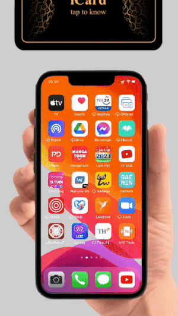

= Thư ngỏ gửi tới Quý Doanh nghiệp
:docinfo: shared
:last-update-label!:

== Tiêu đề 

[Giới thiệu] iCard - Công cụ đắc lực của Nhân viên Kinh doanh 

== Nội dung 

Kính gửi Quý công ty,

Chúng tôi là Công ty Phần Mềm Tiên Tiến Việt Nam, xin giới thiệu với Quý công ty 1 sản phẩm công nghệ mới là iCard.

iCard là Danh thiếp số, với Công nghệ nổi bật "tap to know": chạm vào bằng smartphone để biết về chủ Danh thiếp: thông tin cá nhân, công ty, chức danh hiện tại và nhiều thông tin khác. 

.iCard - Tap to know 

"tap to know" giúp Nhân viên kinh doanh tạo chú ý với *khách hàng lần đầu gặp mặt*. Sự chú ý, tò mò của Khách hàng là cơ hội để giới thiệu thêm công ty, sản phẩm dịch vụ,... tạo ấn tượng ban đầu, và mở ra cơ hội bán hàng, hợp tác trong tương lai. 

Với *khách hàng hiện tại*, "tap to know" khiến buổi trao đổi trở nên *lôi cuốn, thú vị*. Biết được công nghệ mới, tạo nên sự tò mò, muốn được trải nghiệm trên chính điện thoại của mình. Khi khách hàng thích thú với iCard, nhiều nội dung thú vị khác sẽ dễ dàng được chia sẻ. 

Nếu vận dụng tốt, iCard là *Công cụ đắc lực* trong việc tương tác với khách hàng, đối tác, của mỗi Nhân viên, cũng như một phần trong "quy trình bán hàng" của Đội ngũ kinh doanh. 

iCard cũng là *Quà tặng* thú vị, dành cho Khách hàng, Đối tác quan trọng. 
Khác với Quà tặng khác ở vật chất hữu hình, giá trị của iCard là trải nghiệm "tap to know", là công cụ, *phương pháp mới* trong Kinh doanh. 
Cần quan tâm, tương tác sau khi tặng, giúp người nhận vận dụng hợp lý trong thực tế, cũng là cơ hội để củng cố mối quan hệ. 

Nếu quan tâm tới iCard, Chúng tôi sẽ gửi tặng vài bộ iCard để các anh chị trong Quý công ty tự trải nghiệm sản phẩm. 

Và để trải nghiệm đầy đủ các giá trị của iCard, chúng tôi xin được gặp mặt trực tiếp để minh hoạ thực tế các tình huống trên. 

== Gửi qua zalo

Chào anh/chị,

Xin giới thiệu iCard - Công cụ đắc lực của Nhân viên Kinh doanh.

Khách hàng dùng iPhone, chạm vào thẻ iCard là có được thông tin Nhân viên, các dự án bất động sản của bên anh, như clip minh hoạ.

Chỉ với 149k/ 1 bộ, anh có thể đặt 5-10 bộ cho đội ngũ Nhân viên để chăm sóc khách hàng tốt hơn, cải thiện hoạt động kinh doanh. 

Chi tiết xem tại. http://giaiphap.qrcare.vn/iCard/icard-featureList.html

