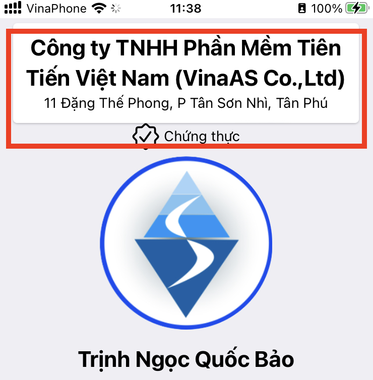

= iCard - Danh thiếp Số 
Quốc Bảo<quocbao@vinaas.com>
v2.0, 2019-03-22
:homepage: https://example.org
:toc:
:last-update-label!:

== Giá trị của iCard 

iCard - Danh thiếp số (digital namecard)

Giá trị cho khách hàng như sau:: 

* *Engagement*: Thu hút khách hàng bằng tính năng chạm NFC để xem, lưu thông tin

* *Promotion*: Quảng bá về công ty, sản phẩm dịch vụ đang cung cấp bên cạnh thông tin nhân viên 

* *Device's Interaction*: nhận biết mức độ quan tâm, chú ý của khách hàng dựa vào sự  tương tác bằng điện thoại với iCard 

Giá  trị cộng thêm với iShop::

* *Peace of mind*: Tăng sự an tâm của khách hàng khi làm việc với nhân viên có Chức vụ, trạng thái làm việc của nhân viên được xác thực bởi Công ty(*)

* *Employee Monitoring*: công cụ để Nhân viên cập nhật kết quả dễ dàng.

== Engagement with iCard

Thu hút người bằng công nghệ chạm NFC::
  bởi tính năng NFC chạm vào bằng điện thoại để xem thông tin.  

.Tap icard
image::https://icard.qrcare.vn/assets/images/video1-bg-1200x800.png[tap,600,0]

video::kXXV2gZDpV0[youtube,width=480,height=320,start=30,opts=autoplay]

[.float-group]
--
[.right]
.iCard sau thay đổi

Thu hút bằng thay đổi Tinh tế:: với kích thước và thông tin hiển thị

* Nổi bật Tên, Chức vụ và Logo, nhận diện công ty

* Kích thước nhỏ gọn, khác biệt ngay từ ban đầu 

* Thông tin chi tiết (số điện thoại, email,...) vào bên trong: xem bằng chạm NFC hoặc quét qrCode

--

Phù hợp với nhiều hoàn cảnh:: 
iCard có nhiều hình dạng tuỳ theo nhu cầu, ngữ cảnh để thu hút khách hàng:

[.float-group]
--

[.right]
.Thẻ cứng NFC

. *Nổi bật, khác biệt*
** Thiết kế riêng theo cá nhân sử dụng
** Thẻ nhựa cứng có thể sử dụng lâu dài 
--

[.float-group]
--
[.right]
.Danh thiep giay
image::2022-09-09-11-16-21.png[dt,200,0]

. *Truyền thống* với Danh thiếp giấy gắn chip NFC

** Truyền thống trao nhận Danh thiếp khi giới thiệu ban đầu.
  
** Tặng Danh thiếp Giấy gắn Chip cho Khách hàng tạo nên sự trang trọng, tinh tế (so với tặng Thẻ cứng)

** Với nhu cầu đưa số lượng nhiều, sử dụng Danh thiếp in qrcode không gắn chip
--

. *Thân mật* tích hợp lên đồ vật cá nhân và chia sẻ ngay khi cần
  
** Ốp lưng điện thoại 
** Móc gắn chìa khoá , hoặc trực tiếp lên chìa khoá 

== Promotion with iCard 

Khi khách hàng đã chú ý, tò mò về iCard, đây là cơ hội để giới thiệu thêm về công ty, sản phẩm dịch vụ bên cạnh thông tin liên hệ. 

Giới thiệu thông tin mới nhất::
Thông qua iCard, nhân viên giới thiệu thêm với Khách hàng về công ty, sản phẩm với các thông tin mới nhất: 

[.float-group]
--
[.right]
.icard 

Truy cập tới iShop hoặc website::  
để xem thông tin mới nhất về sản phẩm, 
dịch vụ mà khách hàng đang quan tâm 
--

[.float-group]
--
[.right]

Xem iCard từ Danh bạ:: 
hướng dẫn cách truy cập từ Danh bạ, 
--

Chữ ký Email:: đường link của iCard đính kèm hình ảnh. 

== Device's Interaction 

Lịch sử tương tác của khách hàng 

Ghi chú về khách hàng theo DeviceId 

== Customer peace of mind with iCard and iShop 

Tăng sự an tâm của khách hàng khi làm việc với nhân viên có Chức vụ, trạng thái làm việc của nhân viên được xác thực bởi Công ty(*)

.vipid
image::https://theme.hstatic.net/200000329903/1000802639/14/banner-homepage.gif[tap,300,0]

Test with code 
ifdef::env-github[]
image:https://img.youtube.com/vi/rAteGra5-xM/maxresdefault.jpg[link=https://youtu.be/rAteGra5-xM]
endif::[]

ifndef::env-github[]
video::rAteGra5-xM[youtube]
endif::[]