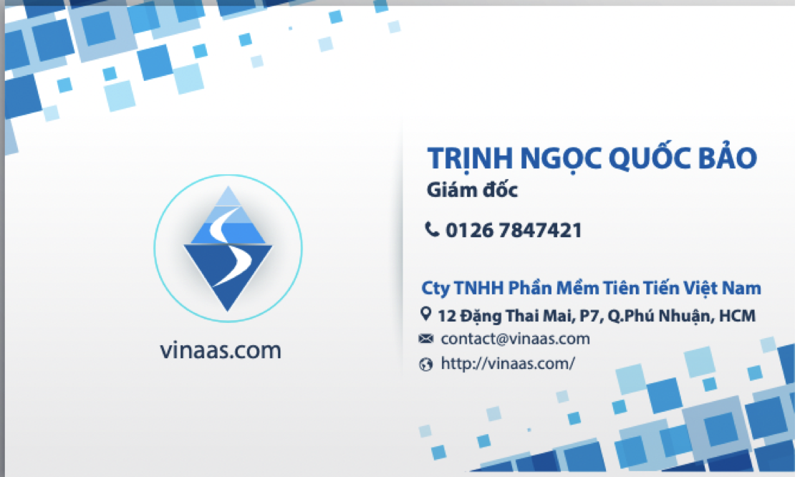
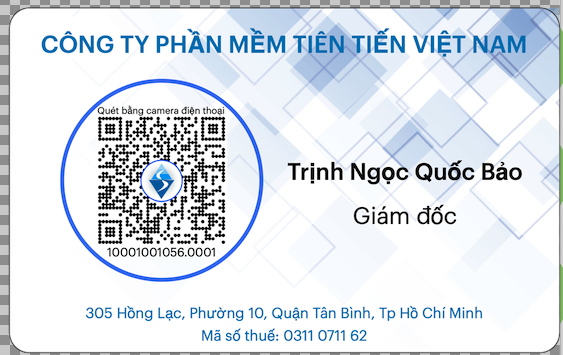
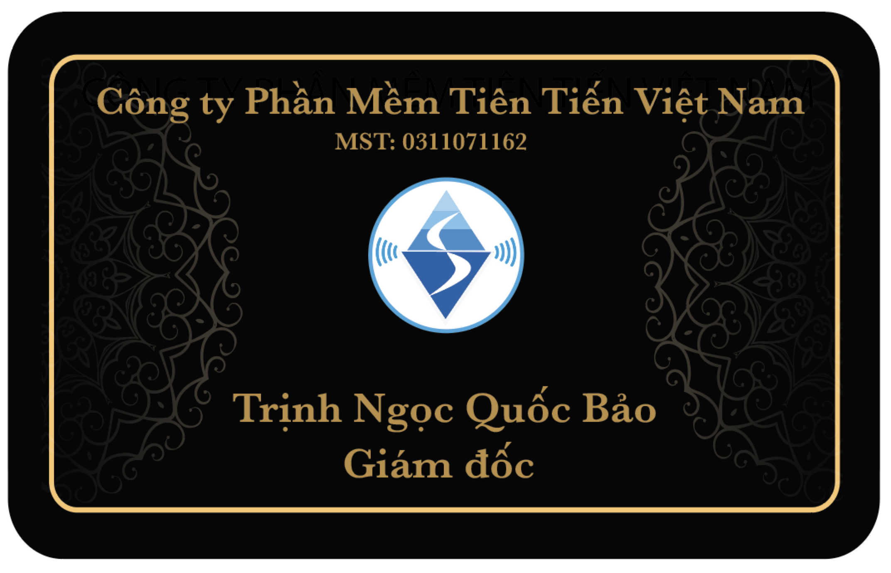
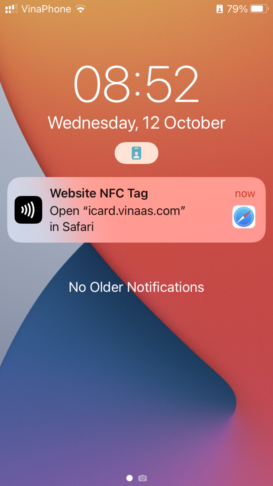

== Tại sao chọn iCard là Giải pháp cho Doanh nghiệp
:docinfo: shared
:last-update-label!:

=== 1. An toàn thông tin với Danh thiếp số iCard

Danh thiếp truyền thống là một hình thức Trao đổi thông tin Kinh doanh, trong đó số điện thoại, email,... in trên bề mặt. 

Trong thời đại smartphone, mạng xã hội phổ biến hiện nay,
Chỉ cần chụp hình và chia sẻ, các thông tin dễ dàng lan toả khắp nơi. 

Khi danh thiếp được số hoá, thông tin cá nhân được lưu trữ trong 1 Url, được mã hoá thành qrcode. 

Tuy nhiên việc "số hoá" càng khiến cho việc thu thập thông tin đơn giản hơn
qua qrcode.

iCard khắc phục các vấn đề trên bằng các biện pháp sau: 

==== 1. Kiểm soát thông tin đã chia sẻ

iCard là Danh thiếp số, với thông tin liên hệ không hiển thị trên bề mặt.

Người đối diện cần chạm trực tiếp vào iCard, để truy cập các thông tin liên hệ được lưu trữ trong 1 URL riêng tư. 

.iCard - Tap to know 
image::icard-taptoknow.gif[tap,300,0]

Để kiểm soát việc chia sẻ URL này, iCard cho phép người dùng giới hạn thời gian và số lượng truy cập, người dùng có thể khởi tạo URL mới thay thế cái đã hết hạn. 

==== 2.Ngăn chặn việc thu thập bằng công cụ tự động

Ngoài ID người sử dụng, URL còn có mã riêng tư (private code) để các công cụ tự động, không thể quét thu thập thông tin một cách bất hợp pháp

* Private code: cơ chế chống dò tìm theo ID, quét, thu thập data từ xa bằng các phần mềm tự động 
* Secure code: mã Pin, password riêng tư cho chủ nhân iCard 

==== 3.Lưu trữ, bảo mật bởi Doanh nghiệp sở hữu

iCard cung cấp các Gói triển khai trên hạ tầng, server riêng của Doanh nghiệp. 
Database được lưu trữ và giám sát bởi đội ngũ IT nội bộ, an toàn về thông tin với bên nhà cung cấp thứ 3. 

=== iCard là giải pháp có thể tuỳ biến theo nhu cầu của Doanh nghiệp 

. *Custom Brand*-Thương hiệu của Doanh nghiệp trên iCard

** Giao diện thẻ với logo, tên Doanh nghiệp 

** Thương hiệu khi chạm NFC

.icard

. *Customization* Tuân thủ các Tiêu chuẩn công nghệ mới nhất như Open API, MicroService, ... 

** Cho phép mở rộng, tuỳ biến theo nhu cầu của Doanh nghiệp 

** dễ dàng kết nối với các hệ thống khác

. iCard được xây dựng bởi bởi Công ty Phần mềm trên 10 năm phát triển giải pháp Phần mềm cho Doanh nghiệp

** Kiến trúc giải pháp (1-1-n++) , giúp hệ thống công nghệ thông tin linh hoạt thay đổi theo hoạt động kinh doanh 

** triển khai thành công nhiều hệ thống Ecommerce, Customer Loyalty, Enterprise Portal, ... cho Doanh nghiệp lớn: Isuzu, MAP Life, SBS Fedex Viet nam, DKSH Smollan, Nutifood,...

=== An toàn thông tin với Danh thiếp số iCard

An toàn thông tin cho Doanh nghiệp:: 

* Doanh nghiệp tự lưu trữ, giám sát thông tin của nhân viên, khách hàng,...

* Cơ chế chống thu thập thông tin tự động từ bên ngoài 

An toàn thông tin cho Nhân viên:: 

* Chia sẻ thông tin có kiểm soát: thời gian hết hạn trên qrcode, nfc 

An toàn thông tin cho khách hàng:: 

* Thông tin trên iCard xác thực bởi Doanh nghiệp

=== 1. why to use digital business card? 

Tại sao cần sử dụng Danh thiếp số có công nghệ NFC

. Tiện dụng với smartphone mới nhất: công nghệ NFC

=== Thế nào là an toàn thông tin cho digital business card 

sharing control::

. basic: chia sẻ có kiểm soát với khách hàng, với những người cần

** NFC: chia sẻ trực tiếp
** qrcode: chia sẻ online, từ xa

. advanced: kiểm soát hình thức chia sẻ

** khoá truy cập qua qrcode

** expired access links : new NFC, qrCode urls

limited access - hạn chế truy cập, thu thập thông tin::

. không thể tìm kiểm bởi google: not allow google Crawl bot

. hạn chế dò tìm qua ID 

. khoá khi truy cập nhiều từ IP không xác định

Các loại Danh thiếp số::

. Cơ bản nhất: có qrcode trỏ về website công ty 

. Thông thường: có qrcode trỏ về trang profile cá nhân 

. Nâng cao: có chip NFC chứa thông tin cá nhân

