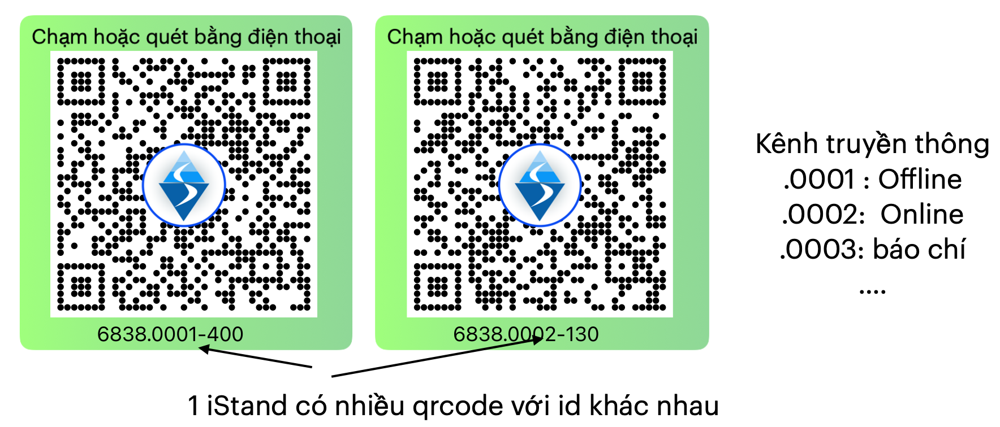

# QiSolution: QiSale <--> QiEvent <--> QiCare
> QiSolutions // quick interactive solutions 
> we Sale / we Event / we Care 

wiSale <--> wiEvent <--> wiCare
qiSale <--> qiEvent <--> qiCare

QiSolutions
  - qiSale : iShops (content) + iCards (staffs) + iDocuments (viewer, member, customers)
  - qiEvent : iStands (content) + iCards (manager, gate checker) + iTickets (visitor, member, customers)
  - qiCare : iShops (product) + iCards (cskh, worker,boss)  + iDevice (customer's paid device)

## QiEvent

3 thành tố (đối tượng cơ bản) của 1 sự kiện: 

- Content (thời gian, địa điểm, ...) của sự kiện
- Staffs (staffs, agency, partner,...) những người 
- Visitors (Customers)

Các đối tượng này có sự điều chỉnh, hành động theo thời gian: trước , trong, sau sự kiện 

- Content: cập nhật theo thời gian : poster, agenda, events images, báo chí,...

- Staffs : social viral (quảng bá), ticket sender (gửi/ xuất vé), gate keeper (soát vé), (give gifts),...

- Visitors : tiếp nhận, muốn tham dự, tới sự kiện, tham gia, nhận quà,mua hàng,...

Một sự kiện thành công là content được tiếp cận tới đúng và nhiều visitors nhất với ngân sách hợp lý: 
Giải pháp của QiEvent:

#### iStands tối ưu hiệu quả phần Content: 
  - 1 Portal for Online and Offline , chuyển tải nội dung 
  - get vistors'info (để lại thông tin, đăng ký tham gia,...), kết nối với iCard, 
 - 1 iStand có nhiều id, cho phép xác định người giới thiệu visitors 
    

> Sự kiện quy mô lớn: nhiều doanh nghiệp tham gia, Triễn lãm | hội chợ, mỗi Doanh nghiệp có 1 iStand độc lập, kết nối với 1 iStand của Ban tổ chức sự kiện 

#### iCards for staffs: 

Nhân viên, cộng tác viên giới thiệu, xuất vé, soát, xác nhận trúng thưởng, tặng quà, ...
  - mỗi iCard có vai trò khác nhau:
  - mỗi iCard có thể giám sát, theo dõi lượng iTicket đã tương tác 

iTickets for visitors, customers: 

- trạng thái theo thời gian của sự kiện
  - trước sự kiện: xác nhận | từ chối tham gia, giới thiệu bạn bè, 
  - trong sự kiện: danh sách gian hàng đã ghé, nhận quà, tham gia,..- sau sự kiện: tới shop, mua hàng, tham gia sự kiện tiếp theo 

- mức độ tương tác:
  - visitor: ít tương tác, ít thông tin cá nhân
  - member: quan tâm, trả lời survey, game,... chưa mua hàng
  - customers: đã mua hàng 

## i(nteractive)Shops + iEvents(iStands + iTickets) + iCards + iDocuments 

1. iDocuments : phát hành có qrcode Công ty
  - mỗi Shop in ra có qrcode iShop, hoặc dán đè qrcode iShop lên chỗ in
  - mỗi iEvents được dán đè qrcode iEvents, hoặc in ra theo từng events luôn
  - in ấn theo nhu cầu và tận dụng tài liệu đã in, nhưng bảo đảm thu thập được dữ liệu theo từng shop, events

1. iEvents: gồm iStands và iTickets (option):
  - iTickets: vé mời có in (hoặc được dán) qrcode, mỗi vé có Id riêng, cho phép lưu thông tin người nhận vé 
  - iTickets có thể dùng Check-in, Check-out tại từng iShop, iStands 

Thiết lập kết nối 
  - 1 iShop cho phép thiết lập các iCards trực thuộc 
  - 1 iEvent cũng cho phép thiết lập các iCards quản lý, với các roles: staffe, checker, superviors 
  - 1 iEvent cũng gồm nhiều iStands bên trong, có roles: BTC, Stand
  - 1 iEvent có nhiều iTickets bên trong 

> Công nghệ tương tác để gia tăng hiệu qủa của Doanh nghiệp trong việc Quảng bá và bán hàng.

Công nghệ qrCode của weSale giúp Thông điệp của Doanh nghiệp được tiếp cận tới nhiều khách hàng trên môi trường Online. 

Nội dung thông điệp của Doanh nghiệp được đóng gói trong 1 qrcode, giúp việc chuyển tải tới khách hàng thông qua Social post, zalo images, ... dễ dàng.
Ví dụ đây là qrcode đóng góp toàn bộ nội dung giải pháp weSale, gồm nhiều sản phẩm cụ thể iShop, iStand, iCard, ...

Khách hàng đã mua, hoặc có tương tác Offline, cũng dễ dàng chia sẻ hình ảnh thực tế, kèm Thông điệp của Doanh nghiệp, tới bạn bè
người thân với vài thao tác Chụp chia sẻ hình ảnh qua OTP như zalo, messenger. 

Xem kẽ với nội dung về sản phẩm dịch vụ, trong Thông điệp của Doanh nghiệp còn kèm các hành động, để khách hàng có nhu cầu sẽ thực hiện như: Gọi điện, Tìm đường, Lưu danh bạ, Để lại thông tin, Đặt hàng,...

weSale còn cung cấp cơ chế định danh (ID) theo từng qrcode, chíp chạm NFC, và tổ chức nhân viên phụ trách, đại lý, cộng tác viên,...theo nhóm ID này.
Mỗi khi có tương tác, dựa vào ID, nhân viên phụ trách sẽ được thông báo, nắm bắt nhu cầu của khách hàng từ đó chăm sóc hỗ trợ tốt hơn. 

### Định nghĩa:

iShop là giải pháp công nghệ giúp khách hàng tương tác dễ dàng với Cửa hàng hơn cho các nhu cầu sau:

Giải thích rất khó khăn, cần minh hoạ bằng video 

- Chỉ cần chạm vào Standee trước cửa hàng (chưa vào trong), là dễ dàng xem thông tin, lưu tên, địa chỉ cửa hàng vào danh bạ cho các lần ghé tiếp theo. 
  - Thông thường là chụp hình bản hiệu, lưu vào điện thoại, tìm kiếm sau này

- Trên tờ rơi giới thiệu về cửa hàng, có qrcode hoặc link để khách hàng dễ dàng truy cập, tìm đường, gọi điện, chat,... hoặc mua hàng

- Chạm và lưu thông tin khuyến mãi, giúp Khách hàng khỏi phải lấy Danh thiếp, tờ rơi và vứt ngay sau khi xem (lãng phí và tạo rác)

### Vấn đề cần giải quyết:

Cần 1 website dễ sử dụng, đơn giản cho 1 Shop: tạp hoá, cửa hàng,...
  - liên kết với zalo, facebook, website chính, ...
  - thông tin cho thanh toán online, momo,...
  - dễ sử dụng: không cần đăng ký, đăng nhập, cài app. Cập nhật thông tin dễ dàng, trực quan. 

Lưu danh bạ: thông tin lâu dài, dễ chia sẻ
  - bán sản phẩm vòng đời sử dụng lâu, 

Dễ dàng tìm đường tới cửa hàng:
  - cửa hàng đổi địa chỉ (sau covid), thông tin trên google map không còn đúng
  - địa chỉ khó tìm kiếm chính xác

Chia sẻ địa điểm, thông tin cửa hàng với bạn bè dễ dàng hơn 
  - share contact 
Chia sẻ thông tin, địa điểm cửa hàng dễ dàng.

### Đối tượng sử dụng

- Các cửa hàng vật lý, showroom cung cấp sản phẩm cần khách hàng tới xem trực tiếp: như sàn bất động sản, cửa hàng vệ sinh,... iShop giúp khách hàng tìm tới cửa hàng dễ dàng hơn. 

- Các cửa hàng vật lý như quán cafe, cửa hàng thời trang, cửa hàng trong siêu thị, .... có nhiều chương trình khuyến mãi.

- iShop phù hợp với cửa hàng Online, bán hàng nhiều kênh như tiki, shopee,... và mong muốn khách hàng quay lại mua tiếp thông qua Thư cảm ơn, ...

### Cách sử dụng iShop

Offline tại cửa hàng
- dán lên cổng ra vào, quầy lễ tân,....
- dán lên menu, bàn, hoặc standee trên 
- dán qrcode lên thư cảm ơn trong đơn hàng

Dùng để thanh toán
- đơn hàng để khách hàng thanh toán qua Momo, chuyển khoản,...

Offline nơi quảng bá: hội chợ, triển lãm
- dán lên Standee trong hội chợ, triễn lãm
- dán lên bản chỉ đường, giới thiệu tới cửa hàng.

Online
- chia sẻ hình ảnh zalo, facebook,...
- hình ảnh PR cho cửa hàng,

## iStandee
- đăng ký thông tin khách mời vào Google Forms, dạng cơ bản của iVisitor 
- dán lên điểm check-in, selfie, chụp hình share facebook,...