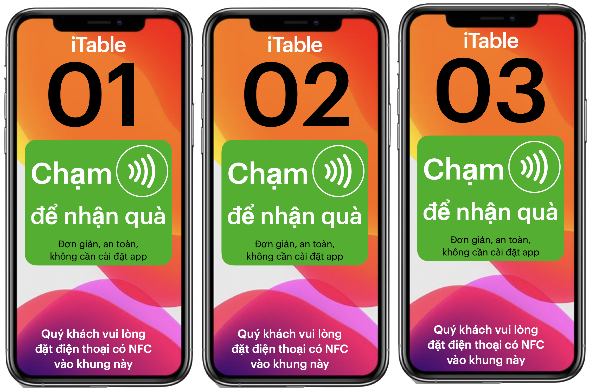

= Tổng quan các sản phẩm của VinaAS 

== iCard - Danh thiếp Xác thực số | Chuyển đổi số nhân viên

=== iCard là gì? 
iCard là công cụ 4.0 mà Doanh nghiệp cần trang bị cho nhân viên, chủ yếu là bộ phận kinh doanh, chăm sóc khách hàng. 3 công dụng chính của iCard là Danh thiếp xác thực số, Giới thiệu sản phẩm, dịch vụ nổi bật và Công cụ báo cáo hiện trường (*). 

iCard có nhiều hình dạng như sticker dán diện thoại, Thẻ cứng in theo yêu cầu, chip dán vào danh thiếp giấy, móc chìa khoá,... 

Với nhân sự cấp cao như Giám đốc, Chủ tịch,... doanh nghiệp nên bổ sung thêm tuỳ chọn thêm cho iCard. 

=== 1. Danh thiếp xác thực số

Với tính năng xác thực chức danh và tình trạng làm việc, Doanh nghiệp sẽ tăng sự an tâm, tin tưởng của khách hàng khi làm việc với nhân viên, đại lý, cộng tác viên được trang bị iCard. 

Lần đầu gặp mặt, iCard gây chú ý bằng công nghệ chạm NFC, để khách hàng kết nối, tạo sự tin cậy bởi thông tin được xác thực bởi Doanh nghiệp. 

Lần sau, gửi chụp hình có qrcode iCard chia sẻ qua zalo là khách hàng dễ dàng trong việc xem thông tin liên hệ, tài khoản thanh toán,… 
Thường xuyên chăm sóc, tương tác với khách hàng ẻ qua Zalo, chat giúp khách hàng ghi nhớ hơn về nhân viên, về doanh nghiệp

=== 2. Công cụ báo cáo hiện trường 

Công cụ báo cáo giúp nhân viên cập nhật ngay hình ảnh, ghi chú tới cấp trên.
Quy trình báo cáo tại chỗ tạo thói quen, tăng hiệu quả cho từng nhân viên.

Ngoài ra, iCard còn giúp nhân viên biết được mức độ tương tác của khách hàng, tăng hiệu quả. 

Tại sao Doanh nghiệp cần trang bị iCard cho mọi nhân viên, cộng tác viên kinh doanh?:: 

. nâng cao hình ảnh, uy tín của Doanh nghiệp với khách hàng
. tăng hiệu quả công việc của từng nhân viên 
. cải thiện kết quả của đội nhóm kinh doanh. 

Mọi nhân viên đều cần iCard, và sẽ thích nếu được Doanh nghiệp trang bị, tặng để sử dụng thay vì bỏ tiền ra mua. 

So với các phần mềm, apps, iCard dễ dàng triển khai khi doanh nghiệp có nhiều nhân viên, ở nhiều khu vực khác nhau. 

iCard là công cụ Chuyển đổi số nhân viên 

iCard sẽ Chuyển đổi số nhân viên kinh doanh. Đầu tiên là số hoá thông tin nhân viên, trước khi chuyển đổi quy trình bán hàng, giới thiệu của từng nhân viên, cu

== iShop - Chuyển đổi số Địa điểm kinh doanh 

Tại sao Doanh nghiệp cần trang bị iShop cho địa điểm, cửa hàng kinh doanh?::

Vì đây là Công cụ giúp cải thiện kết quả của địa điểm kinh doanh 

. Cập nhật khuyến mãi mới nhất giúp Thu hút, lôi kéo khách hàng tới địa điểm kinh doanh

. Phục vụ khách hàng theo khu vực 

. Cải thiện kết quả hoạt động của từng cửa hàng. 

iShop là công cụ số hoá tất cả hoạt động kinh doanh của một cửa hàng

* chương trình khuyến mãi,
* menu sản phẩm
* công cụ tìm đường
* đặt mua online
* gọi điện đặt hàng
* nhận ưu đãi, khuyến mãi

== iMember - Công cụ số hoá Khách hàng

== iShowroom - 

=== "Chạm để nhận may mắn, mua để tặng niềm vui"

Chào quý doanh nghiệp,

Xin giới thiệu với quý anh chị *iShowroom* Mô hình trải nghiệm, bán hàng tại chỗ bên trong điểm kinh doanh có sẵn.

Với thông điệp "*Chạm để nhận may mắn và mua để tặng niềm vui*", Khách hàng tại iShowroom bị thu hút bởi thông điệp trên, sẽ "chạm để nhận quà may mắn", để trải nghiệm sản phẩm mẫu miễn phí, và mua để tặng món quà, mang lại niềm vui cho những người tiếp theo, và nhận voucher khuyến mãi độc quyền để "mua tặng quà" tại các cửa hàng, dịch vụ lân cận. 

"Chạm để nhận" và "Mua để tặng" là 2 hành vi quan trọng của khách hàng mà iShowroom muốn thúc đẩy. 

Chạm bằng điện thoại

* là hành vi sẽ phổ biến, tương tự như quét qrcode để thanh toán, tại điểm kinh doanh hiện tại

* Ngoài việc đi đầu để thúc đẩy hành vi này, công nghệ "Chạm" của iShowroom đáp ứng nhu cầu đa dạng của khách hàng, bên cạnh việc chạm để thanh toán. 

"Mua để tặng" là hoạt động "thiện nguyện" mà iShowroom muốn đề cao trong cộng đồng

** iShowroom sẽ cung cấp giải pháp để khách hàng tự lan toả thông điệp tích cực, thúc đẩy hành động "tử tế" và giám sát kết quả thu được. 

** Ngoài việc kết nối khách hàng, iShowroom còn kết nối cộng đồng doanh nghiệp, ngoài mục tiêu kinh doanh, muốn thể hiện trách nhiệm với cộng đồng. (chi tiết xem Tiếp thị 5.0: Công nghệ vị nhân sinh)

iShowroom cùng phối hợp với quý doanh nghiệp để không ngừng sáng tạo

* những món quà may mắn: nhỏ bé nhưng chứa giá trị tinh thần, phù hợp với nhiều đối tượng vào các dịp trong năm. 

* Khi khách hàng mua sản phẩm, hoặc sử dụng dịch vụ do iShowroom giới thiệu, 2 món quà mới dành cho người chạm tiếp theo và tặng cho trẻ em, đối tượng khó khăn,... sẽ được thêm vào chuỗi iShowroom. 

iShowroom có đầy đủ thành phần của 1 địa điểm kinh doanh 4P

* iDisplay-quầy trưng bày sản phẩm mẫu, voucher đính kèm, kèm với iMenu - bảng giá bán tại chỗ
* iTable - công cụ trải nghiệm, tương tác tại từng bàn 
* iPromotion: hoạt động khuyến mãi định kỳ, nhắm tới đối tượng khách hàng tại khu vực: thu hút khách hàng online, khuyến mãi tại chỗ 
* nhân viên hướng dẫn tại chỗ và cộng tác viên tư vấn, bán hàng online 

Tất cả đều tích hợp sản phẩm iCard, iShop, ... với công nghệ Chạm NFC, quét qrcode.

Nhưng khác với showroom hay cửa hàng truyền thống, iShowroom được hợp tác triển khai bên trong 1 địa điểm kinh doanh có sẵn và duy nhất trong vòng bán kính 500m. 

iShowroom có danh sách sản phẩm mẫu (iSampling) và iVoucher khuyến mãi thuộc nhiều ngành nghề, dịch vụ khác nhau và có 3 mức độ hợp tác:

* Level 1 - Trưng bày: đặt quầy trải nghiệm (iDisplay) và iTable tại từng bàn phục vụ. Khách hàng tự tìm hiểu  và tự kết nối với cộng tác viên của iShowroom 

* Level 2 - Giới thiệu: nhân viên của quán được hướng dẫn về iShowroom, cách giới thiệu với khách hàng khi có nhu cầu. Nhưng menu iShowroom và việc bán hàng, thu tiền độc lập với quán. 

* Level 3 - Bán hàng: sản phẩm tại iShowroom được tích hợp vào menu chung,  nhân viên bán và thu tiền bằng hệ thống POS của quán. 

Địa điểm kinh doanh sẽ lựa chọn danh sách iSampling, iVoucher phù hợp với đối tượng khách hàng đang phục vụ, cũng như lựa chọn mức độ Hợp tác. Dựa vào tương tác "Chạm" của khách hàng và kết quả bán hàng, iShowroom sẽ đánh giá Kết quả hợp tác của từng địa điểm, đề xuất cách cải thiện, 4 tuần / lần.

iShowroom có thể triển khai ngay sau ký kết hợp tác, và nếu không đạt tiêu chí thống nhất, iShowroom sẽ lựa chọn các điểm kinh doanh lân cận để triển khai. 

Chủ địa điểm kinh doanh quyết định việc triển khai iShowroom, bao gồm lựa chọn iSampling (sản phẩm mẫu) và iVoucher phù hợp, mức độ triển khai iShowroom và 

Một vài ngữ cảnh của iShowroom

* Trẻ em tại phòng khám, bệnh viện nhi được tặng những món quà vui vẻ, may mắn tại iShowroom. Phụ huynh có thể ủng hộ, tặng quà các trẻ em khác bằng cách mua lại những món quà đó. 

* Khách hàng tại quán cafe, bị thu hút bởi "Chạm để nhận quà" tại iShowroom, trải nghiệm tại chỗ một số sản phẩm, thực hiện hành động "mua để tặng quà" hoặc nhận voucher khuyến mãi để sử dụng. 

* Khách hàng tại sảnh chờ sân bay Đà Nẵng, bị thu hút bởi "Chạm để nhận quà", trải nghiệm tại chỗ Lọ nhũ vàng, nhận voucher khuyến mãi để sử dụng khi hạ cánh tại Hồ Chí Minh. 

Thông qua iShowroom, quý doanh nghiệp mở rộng được tập khách hàng phục vụ theo nhiều hướng như sau:

. Triển khai iShowroom tới nhà phân phối, đại lý bán hàng hiện tại sẽ giúp sản phẩm, dịch vụ của quý doanh nghiệp nổi bật, gây chú ý so với các sản phẩm dịch vụ của đối thủ. iShowroom là điểm khác biệt để nhân viên kinh doanh, cộng tác viên của quý doanh nghiệp tư vấn từ xa

. iShowroom giúp tiếp cận được những khách hàng quý doanh nghiệp không thể tiếp cận. Ví dụ: khách hàng ở sảnh chờ sân bay, được trải nghiệm sản phẩm sơn

=== tap to get - Chạm để nhận quà:: 

. là thông điệp quan trọng để thu hút khách hàng tại chỗ, cũng như truyền thông, chia sẻ Online để mời khách tới địa điểm kinh doanh.

* Tại mỗi bàn phục vụ, sẽ đặt iTable có chứa thông điệp Chạm để nhận quà, kết hợp với poster, standee tuỳ vào đặc trưng mỗi cửa hàng 

* Các hình ảnh thực tế (và poster ) chứa thông điệp - Chạm để nhận quà, sẽ có qrcode của iShowroom, để thu hút khách hàng tới quán. 

. Món quà có giá trị tinh thần, may mắn, tài lộc,... và duy nhất, và luôn cập nhật mới tại iShowroom. 

* Món quà với ý nghĩa, mang lại niềm vui tiếng cười cho các em nhỏ, là lời động viên, lời chúc may mắn với người được nhận. 

** Chạm để nhận quà , chụp hình, gửi lên iShowroom để nhận được mèo may mắn

** Chạm để tặng quà: chạm và mua mỗi sản phẩm bán ra, iShowroom sẽ dành tặng 1 con mèo may mắn cho các em nhỏ, mang lại niềm vui tiếng cười tại các điểm iShowroom tại trường học, bệnh viện nhi,...

=== iSampling - Sản phẩm mẫu tại iShowroom

* cung cấp trải nghiệm tại chỗ cho khách hàng, kết hợp bán với giá "độc quyền" tại iShowroom

* Một số sản phẩm iSampling có ID và chip riêng để có tính duy nhất, để minh hoạ cho những sản phẩm, quà tặng độc nhất, có thông tin riêng của khách hàng.

. iVouchers - khuyến mãi duy nhất tại iShowroom:: 

=== Chạm để nhận quà và để tặng quà
- ủng hộ quà cho đối tượng khó khăn

=== Trải nghiệm sản phẩm mẫu 
